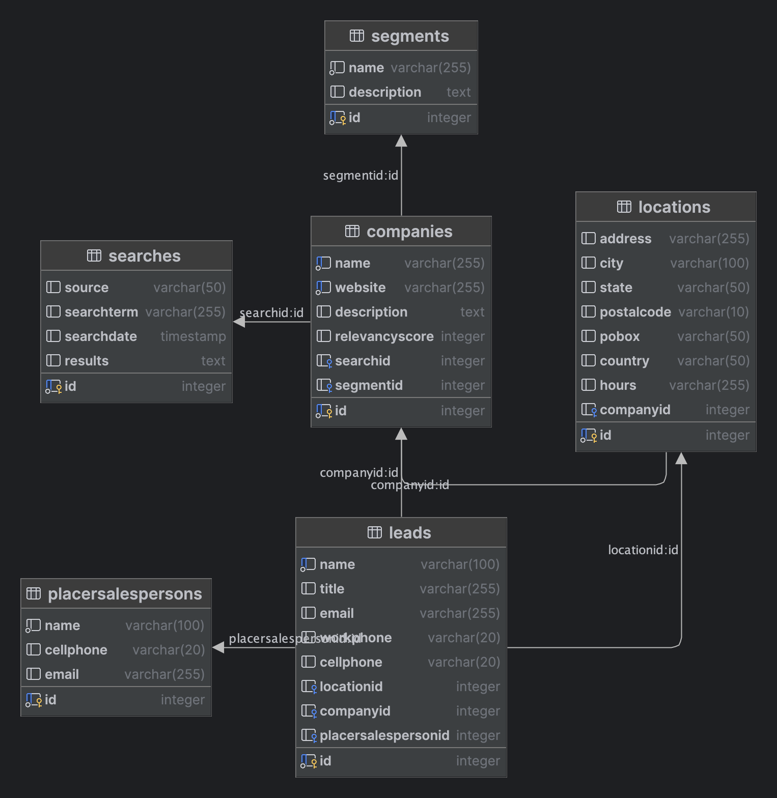

# Scrape and Crawl exercise using SerpAPI and OpenAI

## Prerequisites
  - Docker

## How to run
```shell
docker-compose up -d
```

## How to use
1. Run [src/scrape.py](src/scrape.py) to scrape the first 100 results of a Google search for "web scraping" and save the results in the DB.
2. Query the API to get the results of the scraping.
```shell
curl -X GET --location "http://localhost:5000/segments"
```
3. Review [DDL](db/schema.sql)
   

## How to stop
```shell
docker-compose down
```

## To Do
 - Use Kafka to scale by making the process asynchronous thus scalable
 - Tweaking the parameters of the Completions API to get better results
 - Add Vector Database to store the Completion API results
 - Try with [LangChain](https://anileo.medium.com/building-a-web-scraper-for-scraping-contact-information-from-google-search-a2d9ff53f9ba) and compare results
 - Try with [Diffbot](https://app.diffbot.com/get-started/) and compare results
 - Add GraphQL API to query more flexibly
 - Add unit tests
 - Add more error handling
 - Go through technical debt (TODOs throughout the codebase)
